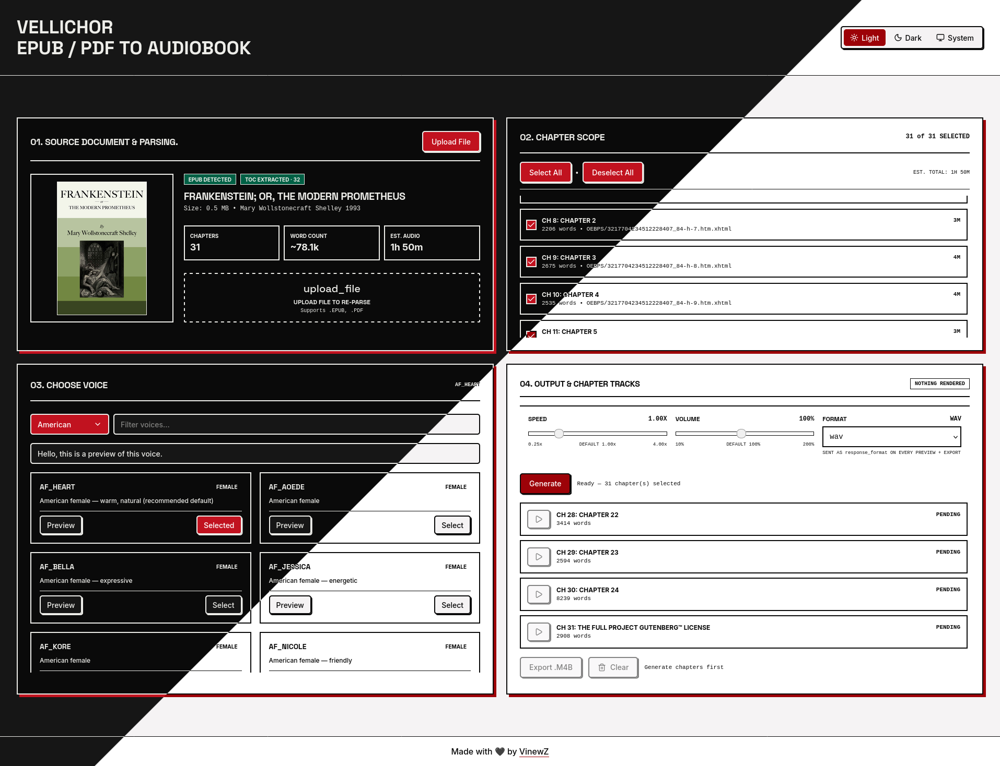

# Vellichor — frontend for Kokoro TTS

Turn PDF / EPUB books into chapter-by-chapter audiobooks and a tagged `.m4b`.

This is a web frontend for [Kokoro TTS](https://github.com/hwdsl2/docker-kokoro) — it does no inference itself, it only sends text chunks to a running Kokoro server (`POST /v1/audio/speech`) and assembles the returned audio.

Speech synthesis by [Kokoro](https://github.com/hexgrad/kokoro) (Apache-2.0) via [docker-kokoro](https://github.com/hwdsl2/docker-kokoro) (MIT) — neither is bundled here; this app only calls its HTTP API. Vellichor itself is [MIT licensed](LICENSE).

Upload a book → pick a voice → render chapters server-side → preview per-chapter audio → export a single M4B with chapter marks, book metadata, and cover art.



9 languages with multiple voices each: 🇺🇸 American · 🇬🇧 British · 🇯🇵 Japanese · 🇨🇳 Mandarin Chinese · 🇪🇸 Spanish · 🇫🇷 French · 🇮🇳 Hindi · 🇮🇹 Italian · 🇧🇷 Brazilian Portuguese.

## Features

- **Book parsing (client-side):**
  - PDF via `pdfjs-dist` (title/author, outline → chapters, first page → cover JPEG).
  - EPUB via `jszip` (dc:title/creator/publisher/date, nav/NCX → TOC, cover-image lookup).
  - 100 MB limit, word count + audio ETA, fingerprint `fileName--sizeMB` for disk cache.
- **Voices & synthesis:**
  - Voice list + preview (`/api/voices`, `/api/speech`), model / speed / volume / format controls.
  - 9 languages (🇺🇸 🇬🇧 🇯🇵 🇨🇳 🇪🇸 🇫🇷 🇮🇳 🇮🇹 🇧🇷), each with multiple male and female voices and per-voice audio preview.
- **Chapter rendering (server-side):**
  - Sentence-aware chunking (`Intl.Segmenter` + line-break preservation, ~3800 chars, Kokoro 4000-char hard limit).
  - Sequential render per chapter, chunk → Kokoro `POST /v1/audio/speech` → concat → `ch-XX.mp3`.
  - Disk layout: `data/books/<fingerprint>/ch-*.mp3 + manifest.json`.
  - Resume done chapters, poll job status, cancel, clear render (`DELETE /api/render?fingerprint=`).
- **M4B export:**
  - `ffprobe` durations → `chapters.meta` (`FFMETADATA1` + `[CHAPTER]`).
  - Global tags: `title / artist / album / album_artist / author / publisher / date / year / comment`.
  - Cover: client blob → base64 (≤5 MB, JPEG/PNG only, SVG skipped) → `cover.jpg/png` → ffmpeg `-disposition:v attached_pic`. Falls back to audio-only on bad cover.
  - `ffmpeg -f concat + -map_metadata 1 -c:a aac 128k -movflags +faststart book.m4b`.
  - Sample output — *Frankenstein; or, The Modern Prometheus* (~6 MB):
    <audio controls src=".github/assets/frankenstein-sample.mp3"></audio>

## Getting Started

```bash
bun install
bun run dev   # vite dev --port 5257
```

Requires for render/export:

- [Kokoro TTS](https://github.com/hwdsl2/docker-kokoro) reachable at `KOKORO_BASE_URL` (**required**, no default — the app errors clearly without it).
- `ffmpeg` + `ffprobe` on PATH (or via `VELLICHOR_FFMPEG_PATH` / `VELLICHOR_FFPROBE_PATH`).

```bash
cp .env.example .env   # set KOKORO_BASE_URL
KOKORO_BASE_URL=http://127.0.0.1:8880 \
VELLICHOR_DATA_DIR=./data \
bun run dev
```

## Docker

Two compose files, one per Kokoro flavor (custom names, so every command needs `-f`):

```bash
cp .env.example .env             # KOKORO_BASE_URL defaults to http://kokoro:8880 in compose
docker compose -f docker-compose-cuda.yaml pull && docker compose -f docker-compose-cuda.yaml up -d   # NVIDIA GPU
# or: docker compose -f docker-compose-cpu.yaml pull && docker compose -f docker-compose-cpu.yaml up -d    # CPU only
```

Images track `vinewz/vellichor:latest` — every release overwrites it and every deploy pulls it, so `pull` always fetches the current bytes. Published tags: `latest`, plus the fix tag it was cut from.

- Services talk over the compose network: Vellichor reaches Kokoro at `http://kokoro:8880`. Pointing at an external Kokoro instead? Set `KOKORO_BASE_URL` to `http://host.docker.internal:8880` (Docker Desktop) or your host's LAN IP (Linux). `127.0.0.1` points at the Vellichor container itself and will fail.
- One env file, one rule: everything lives in `.env` and compose injects it into both services — Vellichor and Kokoro share the `KOKORO_*` lines by construction (leave `KOKORO_BASE_URL` commented to use the same-compose default `http://kokoro:8880`). The only shared secret is the API key: set `KOKORO_API_KEY` in `.env` to require Bearer auth on every request (stays server-side, never sent to the browser), leave it empty for public access. A mismatch surfaces as "Kokoro rejected the API key (401)".
- Data lives in `./data`: `./data/vellichor` (renders, manifests) + `./data/kokoro` (model, voices). If containers can't write there (root-owned bind dirs on Linux): `sudo chown -R $(id -u):$(id -g) data`.
- `ffmpeg` + `ffprobe` are baked into the Vellichor image; no host install needed.
- Kokoro needs ~30–60s to load its model after start; `/api/voices` returns 502 "unreachable" until then — normal, just retry.

## Building For Production

```bash
bun run build   # vite + Nitro → .output/ (node-server preset)
bun run start   # node .output/server/index.mjs (serves client assets + SSR/API)
```

Production runs on Node 22 via the [Nitro](https://nitro.build/) `node-server` preset — the raw TanStack Start server bundle cannot serve static files on its own, Nitro is what serves `dist/client` output. Same shape in Docker: the image builds `.output` and runs it with node.

## API Routes (`src/routes/api/`)

- `POST /api/render` — `{ fingerprint, fileName, voice, synthesis, chapters[] }` → `{ jobId }`. Restores done chapters from `manifest.json`.
- `GET /api/render?id=<jobId>` — job snapshot. `GET /api/render?fingerprint=` — manifest read.
- `DELETE /api/render?id=` — cancel. `DELETE /api/render?fingerprint=` — abort + `rm -rf bookDir`.
- `POST /api/export` — `{ fingerprint, title, metadata {title, author?, publisher?, date?, fileName?}, cover? {dataBase64, mime} }` → `audio/mp4` download. Cover must be JPEG/PNG base64 ≤ ~7 MB string.
- `GET /api/files?fingerprint=&chapter=` — stream chapter MP3. Also `/api/speech`, `/api/voices` (Kokoro proxy).

Verify an export:

```bash
ffprobe -show_entries format_tags -show_entries stream=codec_name,disposition book.m4b
```

## Project Layout

- `src/lib/parse-pdf.ts`, `parse-epub.ts`, `book.ts` — parsing + `ParsedBook` / `ExportMetadata` types.
- `src/lib/chapter-audio.ts`, `synthesis.ts` — chunking, locale map, speech request builder.
- `src/lib/server/render-jobs.ts` — job runner, manifest, `exportM4b()`.
- `src/hooks/useBook.tsx`, `useChapterSelection.tsx`, `useSynthesis.tsx`, `useChapterAudio.tsx` — app state.
- `src/components/book-upload.tsx`, `voice-selection.tsx`, `chapters.tsx`, `mixer.tsx`, `synthesis-controls.tsx` — UI.
- `src/routes/api/` — TanStack Start server handlers.
